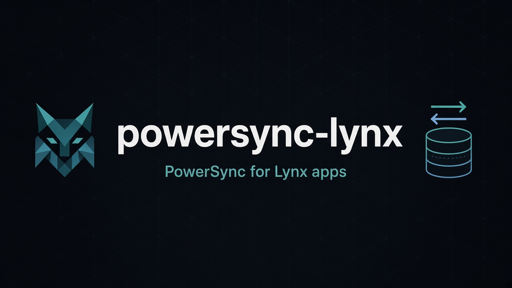

<div align="center" markdown>



**PowerSync JavaScript inside Lynx apps.** One Autolink package, one `PowerSyncDatabase` surface, local SQLite plus sync on web, iOS, and Android.

**[Spec](https://github.com/countertek/powersync-lynx/blob/main/docs/spec.md)** · **[Examples](https://github.com/countertek/powersync-lynx/tree/main/examples)** · **[Glossary](https://github.com/countertek/powersync-lynx/blob/main/CONTEXT.md)**

[](https://github.com/countertek/powersync-lynx/blob/main/LICENSE)
[](https://pnpm.io)
[](https://lynxjs.org)
[](https://www.typescriptlang.org/)

[Changelog](https://github.com/countertek/powersync-lynx/releases) · [Report Bug](https://github.com/countertek/powersync-lynx/issues) · [Request Feature](https://github.com/countertek/powersync-lynx/issues)


</div>

## 🎯 When to use this

You are building a **ReactLynx** app and want the same PowerSync client model as Web / React Native: open a local DB, declare a Schema, `connect` with a Connector, then `get` / `execute` / `watch` while `/sync/stream` stays in Lynx JS.

Use this package when you need:

| Need | What you get |
| --- | --- |
| **One JS API** | `PowerSyncDatabase` typed as official `CommonPowerSyncDatabase` |
| **Native SQL** | Autolinked `NativePowerSyncModule` (async SQL RPC) on iOS and Android |
| **Lynx-for-Web** | Host helper `attach()` mapping that RPC onto WASQLite |
| **Local demo stack** | Compose Postgres + PowerSync + demo API under `examples/` |

Do **not** expect Lynx Explorer to run SQL: Explorer does not register `NativePowerSyncModule`. Windows / macOS hosts are recipe-only today.

## 📦 Install

```bash
pnpm add powersync-lynx @powersync/common
```

For Lynx-for-Web, also depend on the optional peer `@powersync/web` in the **app** (not in the library install graph).

```ts
import { PowerSyncDatabase, Schema, Table, column } from "powersync-lynx";

const schema = new Schema({
  todos: new Table({
    id: column.text,
    description: column.text,
    completed: column.integer,
  }),
});

const db = new PowerSyncDatabase({
  schema,
  database: { dbFilename: "app.db" },
});

await db.waitForReady();
await db.connect(connector); // PowerSyncBackendConnector: fetchCredentials + uploadData
```

Lynx-for-Web host page (not the bundle):

```ts
import { attach } from "powersync-lynx/web-host";
// wire Native Module SQL RPC onto WASQLite for one <lynx-view>
```

## 📱 Platforms

| Platform | Persistence | Sync download path |
| --- | --- | --- |
| **Lynx-for-Web** | Host-page WASQLite via `powersync-lynx/web-host` | Browser `fetch` streaming |
| **iOS** | Native SQLite + PowerSync core through Autolink | `NativePowerSyncModule.httpFetch` |
| **Android** | Same Native Module path | `NativePowerSyncModule.httpFetch` |
| **Windows / macOS** | Documented Autolink recipes only | Not verified in this checkout |

### Native streaming caveat

Stock Lynx fetch cannot reliably deliver live `/sync/stream` NDJSON on device. Native hosts use **`NativePowerSyncModule.httpFetch`**:

1. One-shot callback returns status + `streamingId` (empty body).
2. Chunks arrive as UTF-8 strings on **`GlobalEventEmitter`** (`onData` / `onEnd` / `onError`).
3. `LynxRemote` rebuilds a ReadableStream so PowerSync applies NDJSON incrementally.

Idle-complete / `raw-body` remains a fallback when no event sender is available. Rebuild showcase + host after pulling streaming changes. Details: [iOS host](https://github.com/countertek/powersync-lynx/blob/main/examples/hosts/ios/README.md), [Android host](https://github.com/countertek/powersync-lynx/blob/main/examples/hosts/android/README.md).

## ⚠️ Sync caveats

| Signal | What it means |
| --- | --- |
| **`hasSynced` alone** | Not proof that downloads applied. Confirm `ps_buckets > 0` / row presence and FM-PS-LYNX-003 logs (`via: "chunked"`, `streamingId`). |
| **Realtime on native** | Depends on `streamingId` + GlobalEventEmitter chunks staying open, not a single buffered body. |
| **Local UI ready** | `waitForReady()` opens SQLite; it does **not** wait for `connect()` / first checkpoint. |
| **Demo tokens** | The examples stack mints a static HS256 JWT. Not PowerSync Cloud / JWKS production auth. |

## 🧪 Local demo stack

Consumer TODO app + sync backends live under [`examples/`](https://github.com/countertek/powersync-lynx/tree/main/examples). Full walkthrough: [examples/README.md](https://github.com/countertek/powersync-lynx/blob/main/examples/README.md).

```bash
# 1) Sync profile: Postgres + PowerSync + demo-api
cd examples
docker compose --profile sync up --build

# 2) Library + showcase (from repo root)
cd ..
pnpm install
pnpm bundle-factory
cd examples/showcase
pnpm install
pnpm dev:web   # http://localhost:4173
```

Two-window money shot: open `/?device=a` and `/?device=b` so each client gets its own WASQLite file. Native Autolink hosts: [iOS](https://github.com/countertek/powersync-lynx/blob/main/examples/hosts/ios/README.md), [Android](https://github.com/countertek/powersync-lynx/blob/main/examples/hosts/android/README.md). Desktop stays recipe-only.

## 🛠️ Develop this package

```bash
pnpm install
pnpm test          # Adapter / Client unit tests (node --test)
pnpm lint
pnpm fmt
pnpm typecheck
make test          # Native Module (see Makefile for iOS / Android targets)
```

Requires **Node >= 22.18** (`.nvmrc` / `package.json` `engines`) and pnpm 12 (`packageManager` is `pnpm@12.3.4`).

Normative Client behavior: [docs/spec.md](https://github.com/countertek/powersync-lynx/blob/main/docs/spec.md). Ubiquitous language: [CONTEXT.md](https://github.com/countertek/powersync-lynx/blob/main/CONTEXT.md). ADRs: [docs/adr/](https://github.com/countertek/powersync-lynx/tree/main/docs/adr).

## 🔗 Links

- [Examples guide](https://github.com/countertek/powersync-lynx/blob/main/examples/README.md)
- [License (Apache-2.0)](https://github.com/countertek/powersync-lynx/blob/main/LICENSE)
- [Issues](https://github.com/countertek/powersync-lynx/issues) (no `CONTRIBUTING.md` yet; PRs that match the spec and existing checks are welcome)

---

#### 📝 License

Copyright © 2026 [countertek](https://github.com/countertek). <br />
This project is [Apache-2.0](https://github.com/countertek/powersync-lynx/blob/main/LICENSE) licensed.
